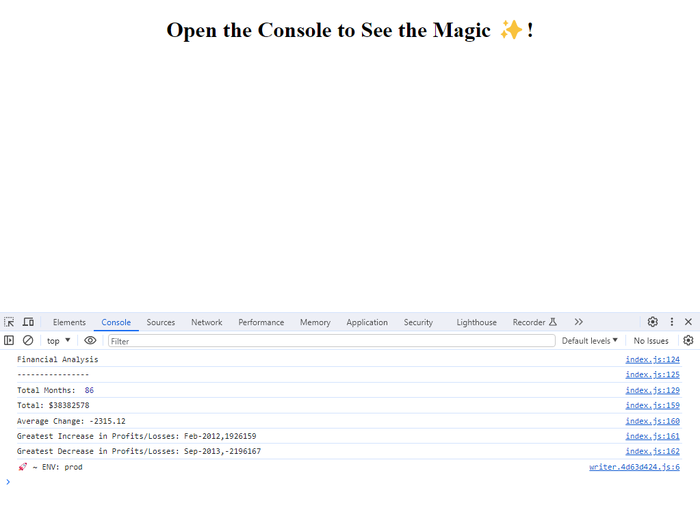

# Console-Finances


## Overview

This repository is the result of the Unit 4 Challenge: Console Finances. In this activity, I used my JavaScript skills to create code for analyzing the financial records of a company. The provided starter/index.js file contains the financial dataset that I worked with.


## Instructions


### Cloning the Repository

1. Initiated the process by creating a new GitHub repository named Console-Finances.
2. Cloned the repository to the local machine.
3. Integrated the starter files into the local git repository.


### Dataset Information

- The financial dataset is structured with arrays containing two fields: Date and Profit/Losses.


### Tasks Completed

Successfully executed the following tasks using JavaScript:

- Calculated the total number of months in the dataset.
- Determined the net total amount of Profit/Losses over the entire period.
- Calculated the average of the changes in Profit/Losses over the entire period.
- Identified the greatest increase in Profit/Losses (date and amount) over the entire period.
- Identified the greatest decrease in Profit/Losses (date and amount) over the entire period.


### Console Output

Upon running the code, the console output mirrors the following example:

```plaintext
Financial Analysis
----------------
Total Months: 86
Total: $38382578
Average Change: -2315.12
Greatest Increase in Profits/Losses: Feb-2012 ($1926159)
Greatest Decrease in Profits/Losses: Sep-2013 ($-2196167)
```


## Screenshot


*The image above provides a snapshot of the console output.*

> **note:** To view the detailed output, right-click, select Inspect, and click on the Console tab in your browser. 


## Deployment

This project is deployed and accessible at the following URLs:

- [Live Application](https://deponte-designer.github.io/Console-Finances/): Explore the console output of this link.
- [GitHub Repository](https://github.com/deponte-designer/Console-Finances): Visit the repository for the project, which includes a README describing the details.

> Feel free to explore the code and the financial analysis results!


## License

[](https://opensource.org/licenses/MIT)

Copyright (c) 2023 [dePonte](https://github.com/deponte-designer)

Permission is hereby granted, free of charge, to any person obtaining a copy of this software and associated documentation files (the "Software"), to deal in the Software without restriction, including without limitation the rights to use, copy, modify, merge, publish, distribute, sublicense, and/or sell copies of the Software, and to permit persons to whom the Software is furnished to do so, subject to the following conditions:

The above copyright notice and this permission notice shall be included in all copies or substantial portions of the Software.

THE SOFTWARE IS PROVIDED "AS IS", WITHOUT WARRANTY OF ANY KIND, EXPRESS OR IMPLIED, INCLUDING BUT NOT LIMITED TO THE WARRANTIES OF MERCHANTABILITY, FITNESS FOR A PARTICULAR PURPOSE AND NONINFRINGEMENT. IN NO EVENT SHALL THE AUTHORS OR COPYRIGHT HOLDERS BE LIABLE FOR ANY CLAIM, DAMAGES OR OTHER LIABILITY, WHETHER IN AN ACTION OF CONTRACT, TORT OR OTHERWISE, ARISING FROM, OUT OF OR IN CONNECTION WITH THE SOFTWARE OR THE USE OR OTHER DEALINGS IN THE SOFTWARE.


## Badges


